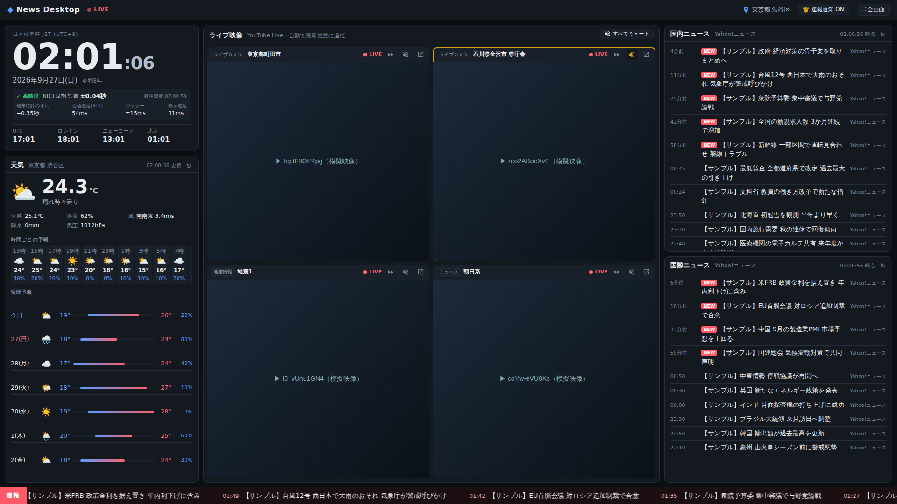

# News Desktop

PC の 1 画面に収まる、パーソナル情報のリアルタイムダッシュボード（Next.js / React）。



## 表示内容と更新間隔

| エリア | 内容 | データソース | 更新 |
|---|---|---|---|
| 左上 | 日本標準時（和暦・世界時計付き）＋同期精度 | [NICT](https://jjy.nict.go.jp/) の時刻と端末時計のずれを補正（失敗時 Akamai → HTTP Date） | 表示: 毎秒 / 同期: 60 秒 |
| 左下 | 現在地の現在の天気・時間予報・週間予報 | [Open-Meteo](https://open-meteo.com/)（位置情報 → [BigDataCloud](https://www.bigdatacloud.com/) で地名化） | 5 分 |
| 中央 | ライブ映像 4 本（渋谷区・金沢市ライブカメラ／地震情報／ニュース） | YouTube Live（IFrame Player API）。配信状態は 5 分ごとに確認 | ライブ端から 6 秒以上遅れたら自動で最新位置へ |
| 右上 | 国内ニュース | Yahoo!ニュース RSS（国内・経済トピックス、国内カテゴリ） | 取得 5 分 / 画面 2 分 |
| 右下 | 国際ニュース | Yahoo!ニュース RSS（国際トピックス、国際カテゴリ） | 取得 5 分 / 画面 2 分 |
| 下部 | 速報テロップ | 国内・国際の直近 1 時間のニュース | ニュースと同時 |

- 時計は NTP と同じ方式（往復遅延の中点）で NICT との時刻差を求めて補正し、
  「誤差 ±x.xx秒」（= 往復遅延/2 + 時刻分解能 + 表示遅延）、端末時計のずれ、通信遅延（RTT）、
  ジッター（直近 8 回の計測のばらつき）、表示遅延をリアルタイムで表示します。
- **速報通知**: Yahoo!ニュース主要トピックスの新着と「速報」「緊急」「津波」などを含む見出しを検出すると、
  通知音（ブラウザ内で合成したチャイム）とポップアップで知らせます。ヘッダーの「🔔 速報通知」から
  通知音・音量・ポップアップ・デスクトップ通知（別タブ表示中）を切り替え、テスト通知も鳴らせます。
  ブラウザの自動再生制限のため、音はページを一度クリックした後から鳴ります。
- **ライブ映像**は音声オフで自動再生します。各映像の 🔈 ボタンでミュート解除（同時に鳴るのは 1 本だけ）、
  ⏩ で最新位置へ移動、ヘッダー右の「すべてミュート」で全消音。2 秒ごとにライブ端からの遅れを測り、
  6 秒を超えると自動で最新位置へ追いつきます（タブ復帰時も最新位置から再開）。配信の種類は `lib/streams.json` で変更できます。
- 配信状態は GitHub Actions が 5 分ごとに確認し（`live-streams.json`）、設定した配信がオフラインなら
  **同じチャンネルで配信中のライブ**に自動で切り替えます（見出しに「代替」表示）。チャンネルで何も配信していなければ
  **「配信休止中」**と表示します。再生中に配信終了を検知した場合もすぐに休止表示にして再確認します。
- 1 時間以内の記事には `NEW` バッジが付きます。
- タブを再表示したときにも即時更新します。各パネルの ↻ で手動更新も可能です。
- 位置情報を許可しない場合は前回の位置、なければ東京（千代田区）を使います。
- 幅 1100px 未満（タブレット・スマホ）では 1 カラムの縦スクロール表示になります。

## 開発

```bash
npm install
npm run dev     # http://localhost:3000
npm run build   # 静的ファイルを out/ に出力
```

## GitHub Pages へのデプロイ

`.github/workflows/deploy.yml` が push のたびにビルドして GitHub Pages に公開します。

1. リポジトリの **Settings → Pages → Build and deployment → Source** を **GitHub Actions** にする（初回のみ）
2. `main`（または作業ブランチ）に push、もしくは Actions タブから `Deploy to GitHub Pages` を手動実行
3. `https://<ユーザー名>.github.io/newsdesktop/` で表示

> Pages の `github-pages` 環境は既定でデフォルトブランチからのデプロイのみ許可されます。
> 別ブランチから公開する場合は Settings → Environments → github-pages で許可ブランチを追加してください。

### ニュース・株価データの取得方法

GitHub Pages は静的ホスティングのため、ブラウザから直接取得できない（CORS 非対応の）
Yahoo!ニュースの RSS は、`.github/workflows/collect.yml` が **5 分ごと**に
GitHub Actions 上で取得し、`data` ブランチに JSON として保存します（`scripts/collect.mjs`）。
ダッシュボードはその JSON を `raw.githubusercontent.com` から読み込みます。

- GitHub の定期実行は混雑時に数分〜十数分遅れることがあります。
- データが 30 分以上古い場合は、公開 CORS プロキシ経由での直接取得も試みます。
  自前のプロキシ（`proxy/cloudflare-worker.js`）を使う場合はリポジトリ変数
  `CORS_PROXY = https://<worker>.workers.dev/?url=` を設定してください。

## 注意

- ライブ映像は配信者側の設定（低遅延モードなど）によって元々の遅延が決まります。ダッシュボード側で減らせるのは再生バッファの遅れのみです。
- ニュースの著作権は各配信元に帰属します。見出しとリンクのみを表示しています。
